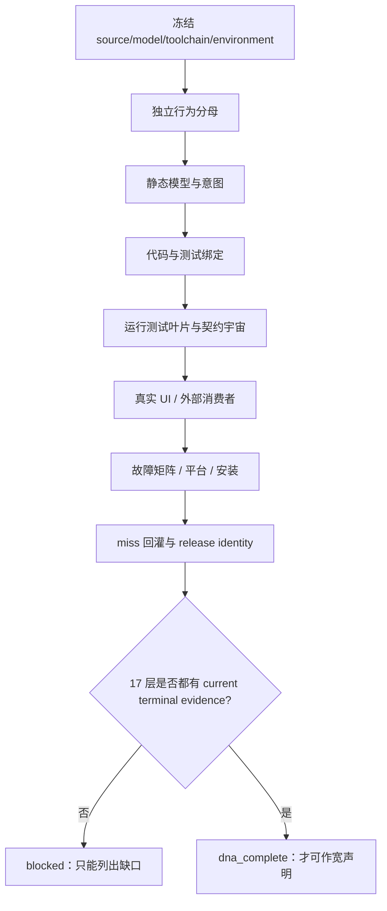

# FlowGuard DNA 级完整性审计与执行清单

审计刷新日期：2026-08-19（原文件名保留历史日期，便于追溯）
对象：`FlowGuard_20260427` 当前工作树
当前结论：**当前权威和无 fallback 的基础设施已经显著补强，但整套 FlowGuard 仍不能宣称 DNA 完成；反向实现分母、真实 UI、完整运行/故障/平台/安装生命周期和 release identity 仍是硬阻断。**

这份清单是给执行能力较弱的 AI 使用的。它把“检查什么、由谁检查、产出什么、什么情况下必须停下”写成固定顺序。任何一项没有终端证据，都只能记为 `not_run`、`stale`、`blocked` 或 `unverified`，不能填成绿色。

## 0. 不可违反的当前权威原则

FlowGuard 采用严格的 current-only、fail-closed 规则。历史 spec、历史 intent、旧模型、旧 receipt 和旧安装投影只是 provenance/source，用来解释来历，**不是不可修改的真理，也不是当前运行时的兼容输入**。执行 AI 必须把每个历史要求在 current intent inventory 中明确写成一种 typed disposition：`accepted_current`、`modified_superseded`、`retired`、`rejected`、`not_applicable` 或 `unresolved`。

- 只有 `accepted_current` 才可以进入 current model；其他状态必须保留处置理由、owner 和当前证据，`unresolved` 必须阻断。
- 当前 source、intent、model、provider、installer 或 toolchain 变化后，受影响的旧模型和 receipt 立即失效；直接人工/AI 重写 current authority，再重新生成当前测试和 terminal receipt。
- 不得增加兼容读入、旧 schema reader、双 manifest、alias、自动迁移、`--resume` 伪装成只读检查、一键升级或 fallback 成功路径。发现旧数据不被当前规则认可时，正确动作是拒绝并直接重写当前数据。
- 反向发现的代码、CLI、模板、配置、UI 控件、安装入口或错误路径，如果没有 current intent，不能默认收编为当前行为；必须先给出上述 typed disposition。无法判定的保持 `blocked_gap`，不得删除、忽略或用测试名反推。
- 一份历史“看起来合理”的 spec/intent 不能授权行为；必须经过 current intent、current model owner、current code owner、current test owner 和同身份 receipt 的完整闭环。

## 1. 先理解完成门

FlowGuard 现在有两层判断：

1. `TargetSystemBlueprint` / `BehaviorBlueprintReport` 等已有层，判断静态模型、语义、代码绑定和测试绑定是否准备好。
2. `flowguard.dna_completion_gate` 的外层门，判断一个“整个产品 DNA 已完成”的宽声明是否有所有必要层的独立终端证据。

外层门固定检查 17 层：



17 层的 canonical id 是：

`static_blueprint_complete`、`semantic_model_complete`、`intent_inventory_complete`、`observed_implementation_surface_complete`、`bidirectional_traceability_complete`、`behavior_binding_complete`、`code_binding_complete`、`static_test_binding_complete`、`runtime_test_execution_complete`、`contract_universe_complete`、`real_ui_surface_complete`、`external_consumer_complete`、`fault_matrix_complete`、`platform_provider_complete`、`installation_complete`、`observed_miss_backfeed_complete`、`release_identity_complete`。

规则非常严格：

- `passed` 必须同时有 owner、输入指纹、终端 evidence id、`sha256:` evidence fingerprint 和 claim boundary。
- `self_reported`、布尔值、进度日志、父级汇总、进程存在、没有输出，都不能授权完成。
- `not_run`、`stale`、`blocked`、`skipped`、`unverified` 都必须保留理由。
- `not_applicable` 也不能自动关闭宽声明；只能用于明确的 scoped claim。
- 不能把 BCL 现有 commitment 行、测试名称或模型名称反过来当作行为分母。

## 2. 本次已经完成的基础设施

以下是当前可以复核的实现，不等于整个 FlowGuard 已完成：

| 项目 | 当前证据 | 结论 |
|---|---|---|
| 分层 DNA 外层门 | `flowguard/dna_completion_gate.py`、`tests/test_dna_completion_gate.py` | 能识别缺层、重复、输入身份不一致、假 UI、未回灌 miss；宽声明仍 fail-closed |
| 运行测试叶片 | `flowguard/runtime_test_evidence.py`、`tests/test_runtime_test_evidence.py` | 保存 collected/deselected/parameter leaf、executed/reused/not-run、outcome、父子计数守恒；不执行 pytest |
| 独立行为分母 | `flowguard/behavior_commitment.py` | 4 种 canonical disposition；历史 `delegated/scoped` 不作兼容别名 |
| 原生发现 owner | `scripts/discover_behavior_inventory.py` | 只读取显式 manifest 和源文件指纹，不扫描 BCL、测试或模型猜行为 |
| 当前 scoped manifest | `docs/flowguard_behavior_inventory_manifest.json` | 仍是 4 行“DNA evidence infrastructure”范围分母；通过守恒，但不是全产品分母 |
| 公共表面缺口审计 | `flowguard/behavior_surface_audit.py`、`scripts/audit_public_behavior_surface.py`、`scripts/discover_behavior_inventory.py`、`scripts/discover_behavior_surface_shards.py` | 2026-08-19 在 generation=128 的 current authority 下重新合并六个 source-only 分片：14,827 个实现观察、4,994 个 review groups（5,029 个 individually addressable surface observations、9,798 个 component-grouped observations）、49,592 个 findings、89 个未建模 UI-like actions；合并状态仍为 `blocked`。source span 是定位锚点，不是“每行代码一条意图”；独立语义 map 仍不能把结构发现冒充 intent 覆盖 |
| UI 运行证据门 | `flowguard/ui_structure.py` | strict 模式现在要求独立 `ProofArtifactRef`、真实结果文件、可重算 producer receipt、源/模型/工具链/环境身份和 cleanup confirmation；内存 fixture、假路径、假 hash 或无 receipt 都不能关闭真实 UI 声明 |
| 外部消费者 | `.flowguard/dna_audit/external-consumer-direct-current-20260819-r4/external-consumer-evidence.json`、`scripts/verify_external_consumer.py` | `flowguard-0.68.15-py3-none-any.whl`（wheel fingerprint `sha256:0e847a0f...`）在仓库外临时 clean consumer 中通过 schema/help、实际 `scenario-review`、public API、template smoke；`status=passed`、findings=0。只证明 clean non-editable wheel 的 bounded smoke，不替代全产品行为、UI、平台或 release 证据 |
| SkillGuard / FlowGuard consumer projection check | `.flowguard/dna_audit/flowguard-install-check-current-no-fallback-20260819.json`、SkillGuard current author evidence | FlowGuard 官方 skill projection：`pass`、copied=0、unchanged=105、conflicts=0、unsafe_paths=0；SkillGuard author-side structural checks and consumer independence remain separate. 普通 consumer 不带 `.skillguard`，不要求安装 SkillGuard；这些结果不替代各自 domain 行为证明 |
| ContractExhaustion 运行汇合 | `flowguard/contract_runtime_evidence.py`、`tests/test_contract_runtime_evidence.py` | 静态有限矩阵与 native executed/reused/not-run case rows 精确对账；不会把 synthetic fault profile 当成真实执行 |
| 当前模型 authority 与 project audit | `.flowguard/tmp/model-system-audit-current-r4.json`、`.flowguard/tmp/project-audit-current-r4.json`、`.flowguard/model-mesh/activations/d04dc0f91e27990d41407d3d59eb8c68170b6a3fcd9fbe55699a32de13446b73.json` | 旧 authority 被检测为 stale 后，基于当前源码直接重写并激活：candidate snapshot `sha256:421754dca0c5c98bf7ad11c5c32c64e380fe27c800f3a2a5292bd04c2ed87647`、revision `sha256:d73484263ddb7fe0d957a891e5e295433038fa6c2e3b4520e015f1be77122cee`、head `sha256:ee6e2d0b4cfb638ba4de2224c078696f8b9b2c38834a53646f6709cc3c5480d4`、activation receipt `sha256:d04dc0f91e27990d41407d3d59eb8c68170b6a3fcd9fbe55699a32de13446b73`；generation=128；`model-system-audit` 与 `project-audit` 均 `pass`、findings=0。这个 pass 只证明当前 authority/topology 基础，不证明全产品 DNA |
| 模型回归与当前受影响范围测试 | `.flowguard/tmp/model-simulator-direct-current-r4.json`、`.flowguard/dna_audit/receipts/focused-tests-direct-current-r4.xml` | full model regression `51/51 passed`、executed=0、reused=51、skipped=0（同一 frozen owner identity 下的合法精确复用）；当前 focused suite 为 `102 passed, 2 subtests passed`。这证明受影响实现与模型回归，不等于全产品 runtime/fault/UI leaf closure |
| 当前宽审计 | `.flowguard/dna_audit/flowguard_dna_assessment.json` | 旧快照不能覆盖本轮源码；重新装配时应保持 `blocked`，并把缺失独立输入/真实 proof/完整 surface map 显式列出 |

当前 assembler 已接受 `--surface-audit`，会把 reverse surface audit 的真实
`blocked/stale/not_run/unverified` 状态附着到
`observed_implementation_surface_complete` 和 `bidirectional_traceability_complete`；
它不会因为有 surface rows、map skeleton 或 sha256 字符串而生成 passed。当前重新装配后的
`.flowguard/dna_audit/flowguard_dna_assessment.json` 两个 reverse layer 都是 `blocked`，
assessment 仍是 `status=blocked`、`dna_complete=false`。

注意：仓库内仍可见的历史 `focused-tests-current.xml` 是旧身份收据，不能把它重新命名为当前收据。当前 `102 passed, 2 subtests passed` 是本轮直接 current rewrite 后的 bounded focused run；下一位执行 owner 仍必须在最终冻结的 source/model/toolchain/environment 下重建其自己的 immutable producer receipt，并把所有 skipped/not-run 保留为带理由的状态。

本次执行还修复并验证了一个审计器自身的边界 bug：当 clean consumer 的临时 venv 放在仓库目录下时，旧检查会把 `site-packages` 误报成仓库源码；现在只禁止真正位于 `repo/flowguard` 下的导入，并要求 package path 在 venv 内。正式 consumer 收据使用仓库外临时根目录，避免 venv 文件污染项目模型审计。

反向闭包的当前分片证据位于
`.flowguard/tmp/implementation-surface-discovery-direct-current-r4.json`、
`.flowguard/tmp/reverse-surface-audit-direct-current-r4.json`。
合并状态为 `blocked`，不是“扫描失败”：observation count=`14,827`，review-group count=`4,994`，individual surface observations=`5,029`，component-grouped observations=`9,798`，finding count=`49,592`，unmodeled UI-like actions=`89`。静态发现已经覆盖结构，但没有把这些数字变成语义闭包；调用归属歧义和没有 current owner/intent 的观察都必须继续处置。审计器已锁住 stale fingerprint 防止重复动态/插件观察造成假 stale；CLI 在只给 discovery、不给独立 map 时也会显式挂出
`implementation_surface_mapping_missing`，不会把反向分母静默省略。
随后生成的 reverse map skeleton 仍是 gap scaffold；每个外部 surface 或 component group 都必须由独立 owner 补齐 current intent、model obligation、code owner、test owner 和 terminal receipt，不能用 skeleton 自身毕业。

### 2.1 这里的“row”不是一行代码

执行 AI 不得把源文件的每一行、局部变量或普通 `if` 分支都拆成独立意图。审计行是“可独立验收的实现表面观察”：

1. `review_granularity=surface`：一个外部可到达或运维上可独立触发的能力，例如一个 CLI command、公共 API、UI action、配置/文件契约、安装入口、provider effect 或可观察故障/恢复动作。它需要自己的 current intent、owner、必要的行为/错误/恢复检查和终端证据。
2. `review_granularity=component`：多个内部函数、私有 helper、局部 effect/fault/recovery 观察属于同一个实现组件时的审查组。它们可以共享一个 proof boundary，但只有在组内每个成员都明确绑定到同一个 current owner/intent/obligation/test/receipt 时才能关闭；未知成员不能借分组自动变绿。
3. source line/span 只作定位锚点，不是意图、不产生额外测试任务。比如“一个 CLI command 调八个 helper”通常是一个 surface 行加一个 component group，不是九行意图；三个独立按钮是三个 surface 行；共用的内部 helper 另成一个 component group。

当前 FlowGuard 的 `14,827` 个 source observations 已压缩为 `4,994` 个 review groups（`5,029` 个 individually addressable surface observations、`9,798` 个 component-grouped observations）。SkillGuard 的同一规则把 `1,626` 个观察压缩为 `1,502` 个 review groups（`1,114` surface、`512` component）。这就是为了避免逐行维护，同时保持反向遗漏不可见。

## 3. 当前 17 层状态

以下状态来自当前工作树，不得当作发布结论：

| 层 | 当前状态 | 真实原因 | 下一动作 |
|---|---|---|---|
| 静态 blueprint | `pass (current scoped authority)` | generation=128 的当前 authority、live snapshot 和 model-system/project audit 均通过；这只是当前拓扑/权威基础，不是全产品行为闭包 | 任何 source/model 变化后直接重写 current authority，再继续全产品分母和 affected closure |
| semantic model | `pass (current authority; broad claim not licensed)` | current snapshot `sha256:421754dca0c5c...` 已激活，56 个 current intent contribution、51 个 model-owner binding；仍未覆盖所有反向实现表面 | 扩展 current intent inventory 和 obligation map；历史要求必须 typed disposition，只有 `accepted_current` 进入模型 |
| intent inventory | scoped candidate / `unverified` for broad DNA | 当前仍只有 4 行 evidence-infrastructure manifest；14,827 个实现观察（4,994 个审查组）是独立结构分母，但没有完整 current intent/model/test map | 由 native discovery/semantic owner 扩展到全产品外部行为并补齐独立收据 |
| observed implementation surface | `blocked` | 当前合并得到 14,827 个观察、4,994 个审查组、49,592 个 finding、89 个未建模 UI-like action；没有 current intent 的代码/UI 不能自动收编 | 对每个 surface 或 component group 给出 governed/internal/retired/N/A 等 typed disposition；source span 只是定位锚点，component 组可以共享明确声明的 proof boundary，但未知成员保持 `blocked_gap` |
| bidirectional traceability | `blocked` | 独立 map skeleton 保留全部观察，但 intent/model/obligation/test/owner/receipt 仍未对 surface/group 完成绑定 | 按 review group 对账 surface/group→intent→model→obligation→test→owner→receipt，并反向对账每个 obligation；不得用 skeleton 直接毕业 |
| behavior binding | `blocked` | 全产品 BCL 仍未 opt in independent denominator | 生成全产品分母，按 surface/group 绑定 BCL/primary model owner |
| code binding | `blocked` | 当前观察发现 49,592 个 finding、89 个未建模 UI-like action，尚无全产品 current semantic owner map | 先给每个 surface/group 一个 typed disposition 和唯一 owner；source span 只是锚点，component 组必须有明确共享 proof boundary，再执行 model-test alignment |
| static test binding | `scoped pass / unverified broad` | 当前 focused suite 为 `102 passed, 2 subtests passed`；这不是全产品 test-leaf 分母，也不关闭 reverse surface | 从 current test inventory 编译完整 test leaf 分母并由 native owner 产出可验证收据 |
| runtime test execution | `not_run` | 只有 reconciliation 模块，没有 native 全叶执行收据 | 单一执行 owner 跑 collection + leaf execution |
| contract universe | `not_run` | 没有冻结全产品 Cartesian/error universe receipt | 由 ContractExhaustion owner 生成有限全集与 oracle |
| real UI surface | `blocked` | 当前 browser/evidence URI 是内存字符串 fixture；无 concrete launch | 找到真实 UI target，产出 browser/desktop/manual proof artifact |
| external consumer | `pass (bounded smoke only)` | 当前 wheel/evidence verifier 为 `status=passed`、findings=0；证明 clean non-editable wheel 的 schema/help/scenario/public API/template smoke，不证明全产品行为、UI、平台或 release | 仍需按全产品分母逐个 surface/group 补消费者行为；不要把 bounded pass 投射为 DNA pass |
| fault matrix | `not_run` | 没有 invalid input/permission/timeout/partial write/retry/recovery campaign | 建立故障矩阵并逐格留证 |
| platform/provider | `not_run` | 没有目标平台/provider matrix | 明确平台、环境、权限、provider owner |
| installation | `pass (projection currentness only)` | 官方 FlowGuard skill projection `copied=0, unchanged=105, conflicts=0, unsafe_paths=0`；这不是软件 installer/upgrade/rollback 生命周期证明 | 跑正式 installer/upgrade/rollback owner，并保留每个平台 current terminal receipt |
| observed miss backfeed | `blocked` | 没有同一 current identity 下的 miss→repair→replay 收据 | 选择真实 miss，走 ModelMissReview 和同类重放 |
| release identity | `blocked` | 工作树有 dirty authority 文件，未授权 tag/CI/release | source/model/toolchain/CI identity 全冻结后才开 release gate |

## 4. 给执行 AI 的固定顺序

### 阶段 0：建立唯一执行 owner，先不运行重验证

1. 记录仓库绝对路径、当前 branch、HEAD、Python、FlowGuard schema/version。
2. 执行 `git status --short`，把所有 dirty path 写入本次 audit identity。
3. 特别检查 `flowguard/explorer.py` 和 `flowguard/model_revision_set.py`。当前两者已有未合入变更，不能覆盖、reset、stash 或假装 clean。
4. 保存 `source_revision`、`model_revision_set`、`toolchain_fingerprint`、`environment_fingerprint`。
5. 如果中断过任何验证，先确认整个 descendant process tree 为 0；`cleanup-unconfirmed` 证据不可复用。
6. 从这里开始，一次只允许一个 full/native owner。不要用 Windows Scheduled Task、后台 resume、无人值守 retry。
7. 在执行前写下本次 `current_authority_policy=direct_current_rewrite_only`。任何旧 schema、旧 intent、旧 model、旧 receipt 或旧安装投影若不匹配 current identity，必须标为 rejected/stale/blocked；不得调用迁移、兼容 reader、alias、fallback、自动升级或旧 receipt 复用。直接重写 current artifact，再重新执行受影响 owner。

停止条件：无法确定唯一 source/model/toolchain/environment identity 时，只能输出 `stale/blocked`，不要跑 full 或 `--resume`。

### 阶段 1：建立真正的外部行为分母

1. 由 native discovery owner 列出所有外部入口：Python import、console command、template、文件格式、配置、UI action、安装/升级、provider、错误恢复。
2. 每个 `surface` 或 `component group` 必须手工/原生填写：`behavior_id`、source kind/ref、public surface、current intent、success、至少一个 error、recovery 或 not-applicable、owner、typed disposition。这里不是每行代码一条记录：line/span 只是定位锚点，内部 helper/局部 effect/fault/recovery 先按组件分组；组内成员全部绑定同一 current proof boundary 才能关闭。历史要求必须另列 provenance，并在 current intent inventory 中写成 `accepted_current`、`modified_superseded`、`retired`、`rejected`、`not_applicable` 或 `unresolved`；只有 `accepted_current` 才能进入 current model。
3. 把源文件路径写入 manifest，运行：

   ```powershell
   python scripts/discover_behavior_inventory.py `
     --root . `
     --manifest <manifest> `
     --output .flowguard/dna_audit/behavior_inventory_evidence.json
   ```

4. 另外运行公共声明缺口审计；它只列出入口声明，不会替你生成行为语义行：

   ```powershell
   python scripts/audit_public_behavior_surface.py `
     --root . `
     --manifest <manifest> `
     --output .flowguard/dna_audit/public_behavior_surface_gap.json `
     --authority-status <passed|blocked|stale|not_run> `
     --authority-reason <reason>
   ```

5. 反向发现的代码/UI/CLI/模板/配置/安装/错误路径若没有 current intent，必须先标为 `blocked_gap` 或 `unresolved`；不得按函数名、测试名、旧 spec 或旧 BCL 行自动收编。
6. 发现缺失、重复、意外 id 时修 manifest；不能删掉那一行来让报告变绿。任何旧 artifact 不被当前 schema 接受时，直接重写 current manifest/intent，不要增加兼容输入。
7. manifest 的 claim boundary 必须说明有没有包含 UI、平台、安装、发布、production integration。
8. 全产品分母完成前，保持 canonical BCL `require_complete_behavior_inventory=false`；scoped 分母不能冒充全产品分母。
9. 当前反向发现的公开行为缺口至少要显式登记 9 类：`python_public_import`、`cli_command`、`template`、`file_format_or_config`、`ui_action`、`installation_upgrade`、`provider_platform`、`fault_recovery`、`release_identity`。未完成的类别保持 `blocked`，不得因为 4 行 scoped manifest 通过而关闭。

停止条件：分母只是从 BCL、测试名或模型名复制出来，立即退回 discovery owner，不能进入下一阶段。

### 阶段 2：冻结模型与拓扑

1. 读取现有 model owner、parent/child/sibling、ModelMesh 和 reattachment 关系。
2. 对每个模型写 `primary_owner`，检查 partition、disjointness、reattachment、leaf closure、affected closure。
3. 先修 source/model revision identity，再运行 blueprint qualification；不要把旧 receipt 与新源码混用。旧 revision 不能通过“升级读取”进入 current authority；必须直接生成 current revision、current snapshot 和新的 activation receipt。
4. 模型只能说明“建模了什么”，不能说明真实 UI、真实消费者或生产平台已经运行。

最低检查顺序：

```powershell
python -c "import flowguard; print(flowguard.SCHEMA_VERSION)"
python -m flowguard project-audit --root .
```

如果 `project-audit` 报 `model_authority_invalid`、`observed_model_inventory_stale` 或 `observed_source_inventory_stale`，先修 authority，不得把后续模型绿化当成完成。当前基线应看到 `model-system-audit=pass`、`project-audit=pass`、generation=128；这些只授权继续审计，不授权 DNA complete。若出现旧 path-quality/legacy residual，直接重写 current artifact，不能打开 `allow_legacy_*` 或其他兼容开关。

### 阶段 3：代码绑定与实现投影

1. 每个 FunctionBlock 写成 `Input × State -> Set(Output × State)`。
2. 每个 surface 或 component group 绑定一个 primary model owner、一个 code owner、一个 facade/adapter boundary；不要为每个 source line 造独立 owner。
3. 对 public API/CLI/UI action 逐项做 `control -> event -> owner -> function -> state/effect -> visible result -> evidence`。
4. 禁止仅凭 import 成功、函数存在、模块可编译来填 `code_binding_complete`。
5. 运行 `review_model_test_alignment()`，把 opaque、unmapped、duplicate、owner missing 逐项处理。

### 阶段 4：静态测试分母与契约全集

1. 从 current `ProjectTestInventory` 生成 exact requested/collected node ids。
2. 参数化测试必须展开为 concrete leaf；父测试计数不能代替 child leaf。
3. ContractExhaustion owner 声明有限 axis、Cartesian combinations、oracle、expected bad cases。
4. 每个 case 指向行为、模型、代码、测试和 evidence；缺一个就是 gap。
5. 记录 skipped/not-applicable/not-run 的理由，不要从 denominator 删除。
6. ContractExhaustion 静态报告生成后，再由 native execution owner 提交逐 case 结果给：

   ```python
   reconcile_contract_exhaustion_execution(...)
   ```

   该汇合必须保留 `required`、`selected`、`explicitly_not_selected`、`executed`、`reused`、`not_run` 以及每个 case 的 oracle/result fingerprint；静态矩阵、coverage percentage、synthetic fault profile 都不能代替逐 case 终端证据。

普通代码测试命令可以是：

```powershell
python -m pytest -q <affected-tests> --junitxml=<receipt>
```

但 JUnit 只证明这次命令的测试结果；它不能证明全产品行为全集，也不能让 runtime execution 自动变绿。

### 阶段 5：真实运行测试叶片

1. native pytest owner 负责 collection、selection、execution、environment/toolchain 和 terminal receipt。
2. 把 collected/deselected node ids、参数叶、每叶的 executed/reused/not-run、outcome、reason、duration 传给 `RuntimeTestEvidenceReport`。
3. 运行 reconciliation，必须满足：
   - `planned = executed + reused + not_run`；
   - `planned = selected + explicitly_not_selected`；
   - 每个失败、跳过、xfailed、xpassed、not-run 都有理由；
   - parent summary 与 leaf projection 一致。
4. `--resume` 是执行命令，不是读收据命令。没有 descendant cleanup 确认时不能重试。
5. 把 runtime receipt 的 source/model/toolchain/environment fingerprints 写进外层 DNA row。

ContractExhaustion 也必须有独立的 case-level reconciliation；不能用 pytest 的父级收据或模型里的静态 oracle 直接填 `contract_universe_complete`。

### 阶段 6：真实 UI / 手工点件

只有目标确实有 UI 时才执行；没有 UI 不能把假的 fixture 当作 pass。

1. 找到真实可启动 target、入口命令、端口/窗口、账号/权限、数据准备和清理方式。
2. 为每个 enabled action 建立可观察清单：control、event、owner、function、state/effect、UI update、evidence。
3. 对每条 happy path、invalid input、permission denied、empty state、timeout、retry、cancel、reopen/refresh 分支实际点击或执行。
4. 每次运行必须产出独立 `ProofArtifactRef`：result path、command/method、exit status、source/model/environment fingerprints、external assertion scope、material proof。
5. 只写 `evidence://...` 字符串或 caller-authored `result=passed` 时，strict UI review 必须保持 blocked。
6. 运行：

   ```python
   review_ui_control_functional_chains(..., require_runtime_proof=True)
   review_ui_implementation_validation(..., require_runtime_proof=True)
   ```

### 阶段 7：真实错误矩阵与 miss 回灌

1. 按 surface/group 行生成故障矩阵：无效输入、边界值、权限、资源不存在、网络/IO、超时、部分写入、重复请求、重试、取消、恢复；一个 component group 的每个成员仍要在组内被枚举或由明确 N/A 证据关闭。
2. 每格写 expected error、observed error、recovery、owner、evidence id/fingerprint。
3. 选择至少一个真实或历史 miss：记录原始 symptom、原始模型为何漏掉、修复后的模型 obligation、代码改动、同类重放、回归证据。
4. 不能只把一个 bug 修好；要判断它是否暴露了新的行为 family，并把 family 反映回分母/契约全集。

### 阶段 8：外部消费者与安装

1. 冻结源码后重新构建 wheel，不复用 dirty worktree wheel。
2. 在 clean temporary venv 安装 `--no-index --no-deps`，验证：
   - `flowguard schema-version`；
   - `import flowguard`、schema、DNA API、runtime evidence API；
   - template entrypoint；
   - package path 位于 venv site-packages，不在 repository source。
3. 使用：

   ```powershell
   python scripts/verify_external_consumer.py `
     --wheel <frozen-wheel> `
     --root <new-clean-consumer-root> `
     --keep-root `
     --output .flowguard/dna_audit/external_consumer_evidence.json
   ```

   consumer root 应放在仓库之外的临时目录；把完整 venv 放进仓库会被项目模型审计当作大量未声明的 governed Python inputs，从而污染 currentness 结果。若必须把证据文件写回仓库，只写 JSON receipt，不要把 venv 留在仓库树内。

4. wheel smoke 不等于官方 installer、升级、rollback、平台 provider 或 release；这些必须由各自 owner 重新产证。当前 bounded wheel verifier 已通过，但仍只能记录为 consumer scoped pass。

### 阶段 9：平台/provider 与安装门

1. 明确支持的平台、Python/runtime、provider、权限、filesystem、network、GPU/desktop 条件。
2. 每个平台至少运行一次真实安装、启动、升级、降级/回滚和卸载检查（若产品有这些行为）。
3. 保留环境指纹、命令、退出码、日志/截图/结果文件和清理确认。
4. 不要把一个 Windows clean venv 结果投射成所有平台绿色。

### 阶段 10：装配外层 DNA 评估

1. 将每个 native owner 的 current terminal evidence 装入 `DnaCompletionAssessment`。
2. 使用 `scripts/assemble_dna_completion_assessment.py` 生成审计快照；如果已经有当前 reverse audit，必须额外传入 `--surface-audit <implementation-surface-map.skeleton.audit.json>`，让两个 reverse layer 进入同一快照。当前脚本会保留未完成层的显式 blocker。
3. 检查 `missing_layer_ids`、findings、输入身份、evidence fingerprint、claim boundary。
4. 只有 `status=dna_complete` 且 `dna_complete=true` 才能使用“FlowGuard DNA 已完成”这句话；`scoped_complete` 只能带着 scope 说。

### 阶段 11：最终验证与发布边界

1. 在一个稳定、冻结的 source/model/toolchain/environment snapshot 上运行一次完整 owner。
2. 先跑 project-audit/current model authority，再跑 affected validation，再跑 full gate；不要反过来。
3. 确认所有 receipt 的 execution owner、输入指纹、toolchain、环境、模型 revision 一致。
4. 任何 source/provider/installer 变化都会使旧 readiness/release evidence 失效；必须重新冻结和重跑。
5. Git commit、tag、CI、release、push 属于外部发布动作，必须另有明确授权；本次审计不自动执行这些动作。

### 阶段 12：清除任何残留的兼容/升级表面

这是严格 current-only 目标的最后一轮源码审查；它不是把旧输入“升级成功”，而是把旧路径从当前能力中移除或标成显式诊断 blocker。

1. 在生产代码、脚本、spec、文档和测试中搜索 `fallback`、`compatib`、`legacy`、`migrat`、`upgrade`、`allow_legacy`、`alias`、`dual reader`、`resume`。逐项填写：文件、符号、是否运行时 authority、current disposition、owner、测试和 receipt。
2. 对 `flowguard/artifact_upgrade.py` 的旧映射/升级 helper、任何 `allow_legacy_*` 开关、旧 path-quality 转换、旧 schema reader 和双 manifest 逐项判定。若不是纯 provenance/诊断输出，直接删除或改为 fail-closed rejection；不要保留成功 fallback。
3. 对 `scripts/assemble_dna_completion_assessment.py` 这类可选旧 assessment/surface 输入路径，确认缺失 current reverse evidence 时结果是 `not_run/blocked`，绝不能兼容旧 assessment 变绿。若存在旧结果读入，移除它并更新测试。
4. 更新相关 current specs、OpenSpec delta、docs 和 tests，使措辞统一为“直接 current rewrite + fresh validation”；旧 spec 只能作为 provenance，不能成为 current model 的隐含输入。
5. 删除/重写完成后，重新生成 current source inventory、intent inventory、model snapshot、revision set、activation receipt、reverse audit、focused/full test receipts、consumer wheel 和 installation check。任何一个旧 receipt 被复用都要标 `stale` 并停止。
6. 只有搜索结果中不存在可授权旧数据成功路径、所有 stale 输入都 fail-closed、且 targeted/full regression 与 project/model audit 在同一冻结身份下通过，才可以把本阶段记为 `passed`；否则记为 `blocked`，并在最终报告列出残留符号。

## 5. 执行 AI 的最小回报格式

每完成一个阶段，写一行机器可读和一段人类可读结果：

```text
phase: <0-12>
owner: <唯一执行者>
status: passed | blocked | stale | not_run | unverified
input_identity: <source/model/toolchain/environment fingerprints>
evidence_id: <receipt/artifact id or empty>
evidence_fingerprint: <sha256 or empty>
claim_boundary: <这份证据到底证明什么>
findings: <完整列表，不省略 skipped/not-run>
next_owner: <下一责任人>
```

## 6. 绝对禁止的捷径

- 不能用模型全绿替代真实软件运行。
- 不能用 parent count、coverage percentage、过程日志替代参数叶。
- 不能用 browser/evidence 内存字符串替代真实 UI proof artifact。
- 不能把 `delegated`、`scoped` 当作新独立分母的兼容值。
- 不能从 BCL、测试或模型反推“所有行为”。
- 不能把 `not_run`、跳过、未发现、超时静默改成 pass。
- 不能在 source/model identity 改变后复用旧 receipt。
- 不能保留旧数据的成功兼容路径：不加 legacy reader、双 manifest、alias、自动 migration、`allow_legacy_*` 开关或 fallback。旧数据不被当前接受时，直接拒绝并重写 current artifact。
- 不能把历史 spec/intent 当作不可修改真理；没有 `accepted_current` 的历史要求不能进入 current model，反向发现且没有 current intent 的代码/UI 必须保持 `blocked_gap` 或完成 typed disposition。
- 不能用 `--resume` 做只读审计。
- 不能在没有 cleanup 确认时启动第二个执行 owner。
- 不能未经授权 push、tag、release 或修改别的工作树。

## 7. 当前执行快照（2026-08-19）

这一轮已经把 current-only/no-fallback 的模型 authority、反向发现器和 bounded consumer/install 证据推进到可复核状态，但没有把外部缺口伪造成完成：

| 检查 | 当前结果 | 解释 |
|---|---|---|
| `project-audit --root . --json` | `pass`，findings=0；model-system-audit 也 `pass` | current snapshot `sha256:421754dca0c5c...` 已激活，model authority generation=128；这是当前 authority/topology 通过，不是全产品 DNA 通过 |
| 独立公共表面审计 | `blocked` | 六分片合并为 14,827 observations、4,994 review groups（5,029 surface / 9,798 component observations）、49,592 findings、89 个未建模 UI-like actions；public gap report 仍有 9 类 unresolved：Python public import、CLI、template、file/config、UI、installation/upgrade、provider/platform、fault/recovery、release identity |
| clean external consumer | `passed (bounded)` | `flowguard-0.68.15-py3-none-any.whl`（wheel fingerprint `sha256:0e847a0f...`）在仓库外临时 clean venv 通过 schema/help/scenario-review/public API/template smoke；evidence status=passed、findings=0；不能升级为 DNA `passed` |
| 当前受影响范围测试 | `102 passed, 2 subtests passed` | 直接 current rewrite/no-fallback 变更后的 focused suite 通过；它不是全产品 runtime leaf、fault、UI 或 release receipt |
| full model regression | `51/51 passed` | executed=0、reused=51、skipped=0；证明同一 frozen owner identity 下模型回归守恒，不证明所有反向实现表面已经有 intent/test/evidence |
| FlowGuard skill projection check | `pass` | copied=0、unchanged=105、conflicts=0、unsafe_paths=0；只证明官方 projection currentness |
| SkillGuard author-side contract/structure | `pass (structure only; final aggregation unverified)` | 当前 SkillGuard 已完成 current contract/manifest 编译、surface inventory、自检、安装暂存验证与直接激活；本轮没有可核验的最终 author-side full TestMesh aggregation/semantic adequacy receipt，因此不能把结构性通过写成 25 个 child receipt 的完整执行通过。普通 consumer 仍独立，不携带 SkillGuard receipt |

当前 source identity 下已直接生成并激活 current revision（不经过旧 path-quality 迁移或兼容读入）：candidate snapshot
`sha256:421754dca0c5c98bf7ad11c5c32c64e380fe27c800f3a2a5292bd04c2ed87647`，revision
`sha256:d73484263ddb7fe0d957a891e5e295433038fa6c2e3b4520e015f1be77122cee`，activation head
`sha256:ee6e2d0b4cfb638ba4de2224c078696f8b9b2c38834a53646f6709cc3c5480d4`，generation=128。
激活 receipt 与 current owner evidence 只对当前 unit 有效；source/model/provider/toolchain 任一变化都必须直接重写并重新验证，不能复用这些 receipt。
| model-regression manifest 影响测试 | `51/51 passed` | full regression executed=0、reused=51、skipped=0；验证同一 frozen model owner mapping，没有关闭 reverse denominator |
| 外层 DNA assessment | `blocked`, `dna_complete=false` | 14,827 个实现观察（4,994 个 review groups）尚无完整 semantic map；真实 UI、runtime leaf、fault/recovery、platform/install lifecycle、miss backfeed、release identity 仍缺独立 terminal evidence |
| OpenSpec strict | 9/9 active changes `valid=true` | artifacts 结构验证通过；`harden-currentness-validation-execution` 的 semantic sync 仍有历史 projection/stale findings，不能把结构 valid 当作 native task 完成 |

本轮还实际复现并修复了一个安装后才暴露的 consumer bug：源码 checkout 的
`scenario-review` 能运行，但原 wheel 没有打包 `examples`，因此 clean
consumer 曾报 `ModuleNotFoundError: No module named 'examples'`；仅有
`--help` 或 `import flowguard` 并不能发现它。现在 `pyproject.toml` 将维护的
`examples*` 包纳入 wheel，`verify_external_consumer.py` 要求真实运行
`scenario-review` 并检查 exit code `0` 与原生 `status: OK`。这只关闭了
一个 bounded packaging/runtime gap，不能扩大为 release 或 whole-product
行为证明。

另外，本轮只在仓库外的隔离临时目录执行了
`install_flowguard_skills.py install`、`check` 和 `parity`；该 FlowGuard
skill-suite projection 的 raw parity 为 `pass`。没有写入官方 `CODEX_HOME`
或其他用户安装根，也没有执行卸载、产品升级/回滚、外部 UI/provider 启动
或 release 命令。因此它不能关闭正式安装生命周期层。

后续 AI 必须从上表继续，而不是从历史绿色数字继续。尤其要先修复并冻结 model authority，再扩展完整行为分母；在真实 UI、运行叶片、故障/平台/安装、miss 回灌和 release owner 没有各自收据前，最终措辞只能是“scoped evidence / blocked audit”，不能写“FlowGuard DNA 已完成”。

## 8. 本次明确留下的真实 blocker

这些不是“还没写完文档”，而是当前无法合法宣称完成的证据缺口：

1. current model authority 已直接重写并激活，generation=128，`model-system-audit` 与 `project-audit` 当前通过；这只关闭 authority stale，不关闭反向实现分母。
2. 没有全产品独立外部行为分母；当前 4 行 manifest 只覆盖 DNA evidence infrastructure，9 个公共行为类别仍未完成。
3. 没有 native full runtime leaf receipt；当前新增模块只负责 reconciliation，不负责替代全产品执行。`102 passed, 2 subtests passed` 是 targeted evidence，不是 full runtime closure。
4. 没有真实 UI target 的 browser/desktop/manual proof；现有 UI fixture/strict contract tests 不能作为产品可用性证明。
5. 没有完整 contract/error/fault/recovery matrix，也没有一条同一 current identity 下的 miss→repair→replay 闭环。
6. 没有完整平台/provider/正式软件 installer 的启动、升级、回滚、卸载证据；skill projection currentness 和 wheel smoke 不能替代它。
7. 没有冻结的 release identity、validated main CI、tag 或发布收据；本次没有执行外部发布。
8. 仍需完成阶段 12 的全仓 current-only residual audit：任何仍能接受旧数据成功的 helper、legacy reader、alias、自动升级或 fallback 都是 P0 阻断，必须删除/改为拒绝并重建全部当前证据。
9. 反向闭包的 `14,827` observations / `4,994` review groups / `49,592` findings（含 `89` 个未建模 UI-like actions）尚未完成 current intent→model→code→test→owner→receipt；source span 不是一条独立意图，component 组可共享明确 proof boundary，但未知成员必须保持 `blocked_gap`，不能删行或降级为“内部实现”。

在这些 blocker 被各自的 native owner 用当前终端证据关闭前，正确结论是：**FlowGuard 的“防止假绿”和 current-only/no-fallback DNA 基础设施已经显著加强，但 FlowGuard 本身的全产品 DNA 级完整性尚未被证明。**任何旧数据不被当前规则接受时，都必须直接重写当前模型/意图/证据并重新验证；本清单不允许用兼容面把它暂时变绿。
